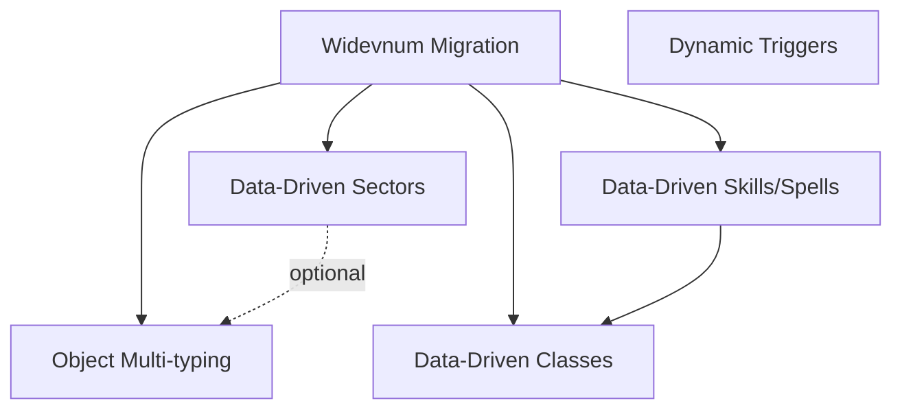

# src_20_dev Modernization Systems - Backport Analysis

**Date**: 2025-01-24  
**Status**: Reconnaissance Complete - Planning Phase  
**Priority**: Post-Widevnum (Phase 9+)

---

## Executive Summary

Five major architectural modernizations from src_20_dev represent significant improvements in code maintainability, content flexibility, and builder productivity. All follow a common pattern: **moving from compile-time constants to runtime data with OLC editors**.

### Systems Analyzed

| System | Status | Complexity | Est. Effort | Priority |
|--------|--------|-----------|-------------|----------|
| [Data-Driven Sectors](#1-data-driven-sectors) | Complete in 20_dev | Low | 3-4 weeks | HIGH ⭐ |
| [Object Multi-typing](#2-object-multi-typing-system) | Complete in 20_dev | Very High | 8-12 weeks | MEDIUM |
| [Data-Driven Skills/Spells](#3-data-driven-skillsspellssongs) | Complete in 20_dev | High | 6-10 weeks | MEDIUM |
| [Data-Driven Classes](#4-data-driven-classes) | Complete in 20_dev | High | 6-10 weeks | LOW |
| [Dynamic Trigger Creation](#5-dynamic-scripting-triggers) | Needs Investigation | Medium | 2-4 weeks | LOW |

**Recommended Order**: Sectors → Skills/Spells → Object Multi-typing → Classes → Triggers

---

## 1. Data-Driven Sectors

### Current State (Legacy)
- **Hardcoded**: `SECT_*` defines in [merc.h](../src/merc.h) (~40 sector types)
- **Inflexible**: Cannot add sectors without recompile
- **Scattered Logic**: Movement costs, regen rates, magic interactions compiled in
- **Example Problem**: Adding "toxic swamp" sector requires code changes in 5+ files

**Files Involved**:
- [const.c](../src/const.c) - Sector tables
- [handler.c](../src/handler.c) - Movement cost logic
- [magic_earth.c](../src/magic_earth.c) - Spell interactions (hardcoded checks like `s1 = 1` for forest)
- [fight.c](../src/fight.c) - Environmental damage
- [act_move.c](../src/act_move.c) - Movement restrictions

### Target State (src_20_dev)

**Complete Implementation** in [/sentience/src_20_dev/sectors.c](../src_20_dev/sectors.c) (1100+ lines)

#### SECTOR_DATA Structure
```c
struct sector_data {
    char *name;                         // "City Streets"
    char *description;                  // Long description for builders
    char *comments;                     // Builder notes
    int sector_class;                   // SECTCLASS_CITY, SECTCLASS_FOREST, etc.
    long flags;                         // aerial, underwater, toxic, no_magic, etc.
    int move_cost;                      // Movement cost multiplier
    int hp_regen;                       // HP regen rate
    int mana_regen;                     // Mana regen rate
    int move_regen;                     // Movement regen rate
    int soil;                           // Soil fertility (for growth spells)
    CATALYST_DATA *affinities[SECTOR_MAX_AFFINITIES];  // Magic affinities
};
```

#### Sector Classes (19 types)
- `SECTCLASS_CITY`, `SECTCLASS_FOREST`, `SECTCLASS_DESERT`, `SECTCLASS_UNDERGROUND`
- `SECTCLASS_DUNGEON`, `SECTCLASS_SWAMP`, `SECTCLASS_WATER`, `SECTCLASS_MOUNTAINS`
- `SECTCLASS_ARCTIC`, `SECTCLASS_JUNGLE`, `SECTCLASS_VOLCANIC`, etc.

#### Sector Flags (20+ flags)
- `SECTOR_AERIAL`, `SECTOR_UNDERWATER`, `SECTOR_TOXIC`, `SECTOR_NO_MAGIC`
- `SECTOR_CITY_LIGHTS`, `SECTOR_DEEP_WATER`, `SECTOR_FROZEN`, `SECTOR_HARD_MAGIC`
- `SECTOR_BRIARS`, `SECTOR_CRUMBLES`, `SECTOR_DRAIN_MANA`, `SECTOR_FLAME`

#### OLC Editor Suite
**Command**: `sectoredit` (full editor in [/sentience/src_20_dev/olc.c](../src_20_dev/olc.c))

**Subcommands**:
- `create <name>` - Create new sector
- `description` - Edit long description
- `comments` - Builder notes
- `flags` - Toggle sector flags
- `class` - Set sector class
- `movecost <value>` - Movement cost
- `health <value>` - HP regen rate
- `mana <value>` - Mana regen rate
- `move <value>` - Movement regen rate
- `soil <value>` - Soil fertility
- `gsct` - Assign to Global Sector Table
- `hidemsgs` - Hide system messages

#### Global Sector Table (GSCT)
Common sectors available globally:
- `city`, `inside`, `underwater_noswim`, `underwater_swim`
- `water_noswim`, `water_swim`

Enables consistent sector references across all areas.

#### Persistence
- **File**: `SECTORS_FILE` (data-driven, not compiled)
- **Format**: Text-based fprintf/fread format
- **Functions**: `save_sector()`, `load_sector()` in [sectors.c](../src_20_dev/sectors.c)

#### Bootstrap Migration
```c
// On first load, converts legacy SECT_* to SECTOR_DATA
void bootstrap_sectors_from_legacy(void);
```
Automatically migrates hardcoded sectors to data-driven system on first run.

### Backport Plan

#### Phase 1: Core Structure (1 week)
1. Add `SECTOR_DATA` structure to [merc.h](../src/merc.h)
2. Create [sectors.c](../src/sectors.c) with hash table and lookup functions
3. Add sector flags and sector classes to [tables.c](../src/tables.c)
4. Implement `save_sector()`, `load_sector()` functions

#### Phase 2: Bootstrap Migration (1 week)
1. Create `bootstrap_sectors_from_legacy()` to convert hardcoded `SECT_*` to `SECTOR_DATA`
2. Add GSCT (Global Sector Table) common sectors
3. Test sector loading on boot

#### Phase 3: Code Refactoring (1-2 weeks)
1. Update [handler.c](../src/handler.c) to use `SECTOR_DATA` properties
2. Update [magic_earth.c](../src/magic_earth.c) to check sector classes/flags
3. Update [act_move.c](../src/act_move.c) movement cost calculations
4. Update [fight.c](../src/fight.c) environmental effects
5. Update any other code using `SECT_*` directly

#### Phase 4: OLC Integration (1 week)
1. Add `do_sectoredit()` command to [interp.c](../src/interp.c)
2. Implement editor subcommands in [olc.c](../src/olc.c)
3. Add help files for sector editing

#### Testing Strategy
- Bootstrap existing areas with legacy sectors
- Verify all movement/regen/magic behavior unchanged
- Test creating new sector types
- Validate persistence across reboots

### Benefits
✓ **Builder Productivity**: Create custom sectors without code changes  
✓ **Content Flexibility**: Unlimited sector types  
✓ **Easier Balancing**: Tune movement costs/regen rates in-game  
✓ **Better Organization**: Sector properties in data file, not scattered across code  
✓ **Clean Migration**: Bootstrap function ensures backward compatibility

### Risks
- **Moderate**: Affects movement/combat/magic systems
- **Mitigation**: Bootstrap preserves all legacy sector behavior exactly

### Dependencies
- None (self-contained system)
- **Benefits from**: Widevnum (cleaner area-scoped sector definitions)

---

## 2. Object Multi-typing System

### Current State (Legacy)
- **Inflexible**: Each object has ONE item type
- **Hardcoded**: `value[0]` through `value[8]` meanings per type
- **Example Problem**: Cannot create weapon that's also a light source without complex workarounds
- **Type-Specific Code**: 73+ item types, each with different value meanings

**Files Involved**: 50+ files reference `obj->value[0-8]`
- [act_obj.c](../src/act_obj.c), [act_obj2.c](../src/act_obj2.c) - Object interactions
- [fight.c](../src/fight.c), [fight2.c](../src/fight2.c) - Combat calculations
- [magic_*.c](../src/magic_*.c) - Spell effects on objects
- [handler.c](../src/handler.c) - Object manipulation
- [save.c](../src/save.c) - Serialization

### Target State (src_20_dev)

**Complete Implementation** across multiple files in src_20_dev

#### Type-Specific Data Structures
```c
// Instead of obj->value[0-8], use typed structures:
struct weapon_data {
    int weapon_type;      // sword, axe, dagger, etc.
    int num_dice;         // 2d4 = 2 dice
    int dice_size;        // 2d4 = 4 sides
    int attack_type;      // slash, pierce, bash, etc.
    long flags;           // two-handed, poisoned, etc.
    // ... more weapon-specific fields
};

struct container_data {
    int capacity;         // Max weight
    long flags;           // closeable, locked, etc.
    int key_vnum;         // Key to unlock
    // ... more container-specific fields
};

struct armor_data {
    int armor_class;      // AC bonus
    int armor_type;       // leather, chain, plate
    long protections;     // Fire, cold, etc.
    // ... more armor-specific fields
};

struct fluid_container_data { /* ... */ };
struct food_data { /* ... */ };
struct money_data { /* ... */ };
// ... more types
```

#### Accessor Patterns
```c
// Type checking
if (IS_WEAPON(obj)) { /* ... */ }
if (IS_ARMOR(obj)) { /* ... */ }
if (IS_CONTAINER(obj)) { /* ... */ }

// Accessing typed data
WEAPON_DATA *weapon = WEAPON(obj);
int damage_dice = weapon->num_dice;

ARMOR_DATA *armor = ARMOR(obj);
int ac_bonus = armor->armor_class;
```

#### Multi-type Support
**Compatibility Matrix** in [/sentience/src_20_dev/item_types.c](../src_20_dev/item_types.c):
- `weapon + light` - ✓ Allowed (glowing sword)
- `container + furniture` - ✓ Allowed (chest that's also a seat)
- `weapon + armor` - ✗ Not allowed (doesn't make sense)
- `weapon + container` - ✗ Not allowed (conflicting mechanics)

Objects can have multiple types simultaneously if compatible.

#### Version Migration
**Tracked in** [/sentience/src_20_dev/save.c](../src_20_dev/save.c):
```c
#define VERSION_OBJECT_006  6  // FOOD migration
#define VERSION_OBJECT_007  7  // CONTAINER migration

if (obj->version < VERSION_OBJECT_006) {
    // Migrate value[0-8] to FOOD_DATA structure
}
if (obj->version < VERSION_OBJECT_007) {
    // Migrate value[0-8] to CONTAINER_DATA structure
}
```

Explicit migration path from legacy `value[]` to typed structures.

#### Script Integration
**Entity Types** in [/sentience/src_20_dev/script_const.c](../src_20_dev/script_const.c):
```c
ENTITY_OBJ_TYPE_WEAPON
ENTITY_OBJ_TYPE_CONTAINER
ENTITY_OBJ_TYPE_ARMOR
ENTITY_OBJ_ARMOR_PROTECTIONS  // Access armor properties
ENTITY_OBJ_WEAPON_DAMAGE      // Access weapon damage
// ... entity fields for each type
```

Scripts can access type-specific properties directly.

### Backport Plan

#### Phase 1: Core Structures (2 weeks)
1. Define type-specific structures in [merc.h](../src/merc.h)
2. Add multi-type fields to `OBJ_DATA` structure
3. Create `IS_WEAPON()`, `IS_ARMOR()`, etc. macros
4. Create `WEAPON()`, `ARMOR()`, etc. accessor macros
5. Implement multi-type compatibility matrix in new [item_types.c](../src/item_types.c)

#### Phase 2: Conversion of High-Impact Files (3-4 weeks)
1. **Combat System** ([fight.c](../src/fight.c), [fight2.c](../src/fight2.c))
   - Replace `obj->value[1]` with `WEAPON(obj)->num_dice`
   - Replace `obj->value[2]` with `WEAPON(obj)->dice_size`
2. **Object Handlers** ([handler.c](../src/handler.c))
   - Update weight calculations
   - Update capacity checks
3. **Magic System** ([magic_*.c](../src/magic_*.c))
   - Update identify spell to show type-specific data
   - Update enchantment spells to use typed structures

#### Phase 3: Remaining File Conversions (3-4 weeks)
1. Convert all remaining files (~40+ files) referencing `obj->value[0-8]`
2. Update all object creation code
3. Update all serialization code

#### Phase 4: Migration System (1-2 weeks)
1. Implement version tracking in [save.c](../src/save.c)
2. Create migration functions for each type
3. Test migration of existing objects

#### Phase 5: Script Integration (1 week)
1. Update script entity system to use typed structures
2. Test all object-related scripts

#### Testing Strategy
- **Critical**: Test EVERY object interaction (combat, wear, drop, get, etc.)
- Verify weapon damage unchanged
- Verify armor AC unchanged
- Verify container capacity unchanged
- Test multi-type objects (weapon+light, etc.)
- Migration testing: Load legacy objects, verify properties preserved

### Benefits
✓ **Type Safety**: Compile-time checking of type-specific data  
✓ **Cleaner Code**: `WEAPON(obj)->damage` instead of `obj->value[1]`  
✓ **Multi-typing**: Create combo objects (glowing weapons, etc.)  
✓ **Extensibility**: Add new object types without breaking existing code  
✓ **Script Improvement**: Access typed properties directly in scripts

### Risks
- **VERY HIGH**: Touches 50+ files, affects combat/magic/object systems
- **Mitigation**: Extensive testing, phased rollout, version migration

### Dependencies
- **Benefits from**: Widevnum (cleaner vnum management for typed objects)
- **Prerequisite for**: None (self-contained, but foundational)

---

## 3. Data-Driven Skills/Spells/Songs

### Current State (Legacy)
- **Hardcoded**: `skill_table[MAX_SKILL]` in [const.c](../src/const.c) (~3000 lines)
- **Inflexible**: Cannot add skills without recompile
- **Balance Issues**: Tuning skill damage/costs requires recompile + MUD restart
- **Example Problem**: Adding "fireball mark 2" spell requires code changes

**Files Involved**:
- [const.c](../src/const.c) - Massive skill table
- [handler.c](../src/handler.c) - Skill lookups
- [update.c](../src/update.c) - Skill gain checks
- [skills.c](../src/skills.c) - Skill system logic

### Target State (src_20_dev)

**Complete Implementation** with in-game editors

#### SKILL_DATA / SPELL_DATA Structures
```c
struct skill_data {
    char *name;                    // "fireball"
    char *description;             // Help text
    int skill_level[MAX_CLASS];    // Level available per class
    int rating[MAX_CLASS];         // Difficulty rating per class
    SPELL_FUN *spell_fun;          // Function pointer
    int target;                    // TAR_CHAR_OFFENSIVE, etc.
    int minimum_position;          // POS_STANDING, etc.
    int mana;                      // Mana cost
    int wait;                      // Lag
    char *damage_msg;              // Combat message
    char *off_msg;                 // Spell off message
    char *obj_msg;                 // Object message
    // ... more fields
};
```

**Already Have** `SPELL_DATA` serialization in [/sentience/src/json_persist.c](../src/json_persist.c):
- `spell_to_json()` - Serialize spell to JSON
- `json_to_spell()` - Load spell from JSON

#### Song Editor
**Command**: `songedit` (implemented in [/sentience/src_20_dev/olc.c](../src_20_dev/olc.c))

Found in:
- [/sentience/src_20_dev/interp.c:451](../src_20_dev/interp.c#L451) - Command table entry
- [/sentience/src_20_dev/olc.c:4753](../src_20_dev/olc.c#L4753) - `do_songedit()` implementation
- [/sentience/src_20_dev/tables.c:4878](../src_20_dev/tables.c#L4878) - Function mapping

**Skill Group Editor**: `sgedit`, `sglist`, `sgshow` commands exist

#### Persistence
**Functions** in [/sentience/src_20_dev/comm.c:99](../src_20_dev/comm.c#L99):
```c
bool load_skills();
void save_skills();

bool load_songs();
void save_songs();
```

Skills/spells/songs loaded from data files at boot, not compiled.

### Backport Plan

#### Phase 1: Core Structures (2 weeks)
1. Define `SKILL_DATA`, `SPELL_DATA`, `SONG_DATA` structures in [merc.h](../src/merc.h)
2. Create hash tables for runtime lookup
3. Implement `load_skills()`, `save_skills()` functions
4. Implement `load_songs()`, `save_songs()` functions

#### Phase 2: Bootstrap Migration (2 weeks)
1. Create bootstrap function to convert hardcoded `skill_table[]` to `SKILL_DATA` structures
2. Export all skills to data files on first run
3. Verify skill loading preserves all properties

#### Phase 3: Code Refactoring (2-3 weeks)
1. Update [handler.c](../src/handler.c) skill lookups to use hash table
2. Update [update.c](../src/update.c) skill gain to use `SKILL_DATA`
3. Update [skills.c](../src/skills.c) to use runtime data
4. Update all spell casting to use `SPELL_DATA`

#### Phase 4: Editor Implementation (2-3 weeks)
1. Implement `do_skilledit()` command in [olc.c](../src/olc.c)
2. Implement `do_spelledit()` command
3. Implement `do_songedit()` command (port from src_20_dev)
4. Implement skill group editors (`sgedit`, etc.)
5. Add help files

#### Testing Strategy
- Bootstrap all existing skills/spells/songs
- Verify all spell damage/costs unchanged
- Test skill learning rates
- Test in-game skill creation
- Validate persistence across reboots

### Benefits
✓ **Balance Tuning**: Change spell damage/costs in-game, no recompile  
✓ **Content Creation**: Add new spells/skills without code changes  
✓ **Builder Productivity**: Rapid iteration on skill design  
✓ **Better Organization**: Skill data separate from code

### Risks
- **HIGH**: Core game mechanic, affects all classes
- **Mitigation**: Bootstrap preserves exact behavior, extensive testing

### Dependencies
- **Benefits from**: Data-Driven Classes (skill learning tied to classes)
- **Prerequisite for**: None (self-contained)

---

## 4. Data-Driven Classes

### Current State (Legacy)
- **Hardcoded**: 4 classes (mage, cleric, thief, warrior) × 30 levels
- **Remort = Restart**: Remort resets character to level 1
- **Inflexible**: Cannot unlock new classes, must choose at creation
- **No Account Progression**: Each character isolated

**Class Structure**:
- `class_mage`, `class_cleric`, `class_thief`, `class_warrior` (primary class per type)
- `second_class_*` (secondary class per type)
- `sub_class_*`, `second_sub_class_*` (subclasses)
- All stored as integers in [pcdata](../src/merc.h) structure

**Files Involved**:
- [const.c](../src/const.c) - Class tables
- [skills.c](../src/skills.c) - Remort logic
- [update.c](../src/update.c) - Level advancement
- [nanny.c](../src/nanny.c) - Character creation

### Target State (src_20_dev)

**Complete Implementation** with unlock system

#### CLASS_DATA Structure
```c
struct class_data {
    char *name;                    // "Mage"
    char *description;             // Long description
    int max_level;                 // Max level for this class
    char *base_group;              // Base skill group
    char *default_group;           // Default skill group
    int attr_prime;                // Primary attribute
    long weapon;                   // Starting weapon
    int hp_min;                    // HP gain min
    int hp_max;                    // HP gain max
    bool fMana;                    // Gains mana?
    // ... more fields
};
```

#### CLASS_LEVEL System
**Found in** [/sentience/src_20_dev/save.c:7431](../src_20_dev/save.c#L7431):
```c
struct class_level {
    CLASS_DATA *clazz;    // Pointer to class data
    int level;            // Current level in this class
    long xp;              // Experience in this class
};

// Character can have multiple CLASS_LEVEL entries
void insert_class_level(CHAR_DATA *ch, CLASS_LEVEL *cl);
CLASS_LEVEL *get_class_level(CHAR_DATA *ch, CLASS_DATA *clazz);
```

**Progression Model**:
- Characters have multiple `CLASS_LEVEL` entries
- Level **one class at a time**
- Switch active class, gain XP only in active class
- Remort changes character permanently (not restart)

#### Unlock System
**References found** in search results:
- Classes unlock through gameplay progression
- Account-level race unlocking (once discovered, available for new characters)
- Remort classes have prerequisites

**Functions** in [/sentience/src_20_dev/comm.c:99](../src_20_dev/comm.c#L99):
```c
bool load_classes();
void save_classes(bool booting);
```

#### Experience System
**New XP calculation** in [/sentience/src_20_dev/skills.c:2480](../src_20_dev/skills.c#L2480):
```c
long exp_per_level(CHAR_DATA *ch, CLASS_DATA *clazz, long points) {
    CLASS_LEVEL *level = get_class_level(ch, clazz);
    if (!IS_VALID(level)) return 0;

    if (level->level < level->clazz->max_level)
        expl = exp_per_level_table[level->level].exp;
    else
        expl = 0;

    return expl;
}
```

XP calculated per class, not global.

### Backport Plan

#### Phase 1: Core Structures (2 weeks)
1. Define `CLASS_DATA` structure in [merc.h](../src/merc.h)
2. Define `CLASS_LEVEL` structure
3. Add `CLASS_LEVEL` list to `PC_DATA`
4. Implement class hash table and lookup functions
5. Create `load_classes()`, `save_classes()` functions

#### Phase 2: Bootstrap Migration (2 weeks)
1. Create bootstrap to convert hardcoded `class_table` to `CLASS_DATA`
2. Migrate existing character class data to `CLASS_LEVEL` system
3. Test class loading on boot

#### Phase 3: Progression System (2-3 weeks)
1. Update [update.c](../src/update.c) to use `CLASS_LEVEL` XP
2. Update [skills.c](../src/skills.c) remort to NOT restart character
3. Implement class switching (change active class)
4. Update skill learning to check active class level

#### Phase 4: Unlock System (1-2 weeks)
1. Implement class unlock conditions
2. Add account-level race unlocking
3. Update character creation to show unlocked races/classes

#### Phase 5: Editor Integration (1 week)
1. Implement `do_classedit()` command in [olc.c](../src/olc.c)
2. Add help files

#### Testing Strategy
- Bootstrap all existing classes
- Test multiclass progression
- Test remort (should NOT reset level)
- Test class switching
- Verify skill learning with multiple classes
- Test account-level unlocks

### Benefits
✓ **Better Progression**: Remort adds to character, not restart  
✓ **Multiclass**: Level multiple classes independently  
✓ **Account Unlocks**: Reward long-term play  
✓ **Flexibility**: Switch active class for different situations

### Risks
- **HIGH**: Core progression system, affects all players
- **Mitigation**: Bootstrap preserves current progression, extensive testing

### Dependencies
- **Benefits from**: Data-Driven Skills/Spells (skill learning tied to class level)
- **Prerequisite for**: None (self-contained)

---

## 5. Dynamic Scripting Triggers

### Current State (Legacy)
- **Hardcoded**: `TRIG_*` constants defined at compile-time
- **Inflexible**: Cannot create new trigger types without code changes
- **Example Problem**: Want "on_player_enters_drunk" trigger → requires code

**Files Involved**:
- [scripts.c](../src/scripts.c) - Script engine
- [script_*.c](../src/script_*.c) - Trigger handlers

### Target State (src_20_dev)

**Status**: NEEDS DEEPER INVESTIGATION

**Evidence**:
- Trigger system exists in both codebases
- src_20_dev likely has in-game trigger creation
- Need to search for trigger editors and trigger data structures

### Backport Plan

**Pending Investigation**: Need focused searches to find:
1. Trigger editor implementation
2. `TRIGGER_DATA` structure (if data-driven)
3. Trigger creation/registration system
4. Persistence functions

**Estimated Effort**: 2-4 weeks (if similar to other data-driven systems)

---

## Cross-System Dependencies



**Dependency Notes**:
- **Widevnum First**: All systems benefit from widevnum's cleaner area-scoped data
- **Skills → Classes**: Class progression affects skill learning
- **Sectors ↔ Multi-typing**: Minor interaction (containers in sectors, etc.)
- **All Independent**: Each system can be backported separately

---

## Recommended Backport Sequence

### Phase 9: Data-Driven Sectors (3-4 weeks)
**Why First**:
- ✓ Smallest scope (~10 files)
- ✓ Cleanest implementation
- ✓ Immediate builder productivity gain
- ✓ No dependencies on other systems
- ✓ Low risk

**Deliverables**:
- [sectors.c](../src/sectors.c) with SECTOR_DATA system
- OLC editor (`sectoredit`)
- Bootstrap from legacy SECT_*
- Help files

### Phase 10: Data-Driven Skills/Spells/Songs (6-10 weeks)
**Why Second**:
- ✓ Affects all classes (better before class system changes)
- ✓ Enables skill balancing without recompile
- ✓ Foundation for class unlock system
- ✓ SPELL_DATA serialization already exists

**Deliverables**:
- [skills.c](../src/skills.c) refactored for runtime data
- OLC editors (`skilledit`, `spelledit`, `songedit`)
- Bootstrap from hardcoded skill_table
- Help files

### Phase 11: Object Multi-typing (8-12 weeks)
**Why Third**:
- ✓ Large scope (50+ files)
- ✓ Foundational improvement
- ✓ Enables better object design
- ✓ Sectors system completed (minor interaction)

**Deliverables**:
- Type-specific structures in [merc.h](../src/merc.h)
- [item_types.c](../src/item_types.c) compatibility matrix
- All object-handling code refactored
- Version migration in [save.c](../src/save.c)

### Phase 12: Data-Driven Classes (6-10 weeks)
**Why Fourth**:
- ✓ Complex progression changes
- ✓ Skills system completed (prerequisite)
- ✓ Major gameplay change (remort model)
- ✓ Affects all existing players

**Deliverables**:
- [class_level.c](../src/class_level.c) with CLASS_LEVEL system
- Class switching system
- Account-level unlocks
- OLC editor (`classedit`)
- Migration for existing characters

### Phase 13: Dynamic Triggers (2-4 weeks)
**Why Last**:
- ✓ Lowest priority (builder tool)
- ✓ Needs investigation first
- ✓ No critical dependencies

**Deliverables**:
- TBD after investigation

---

## Total Effort Estimate

| System | Weeks | Risk | Priority |
|--------|-------|------|----------|
| Sectors | 3-4 | Low | HIGH ⭐ |
| Skills/Spells | 6-10 | High | MEDIUM |
| Object Multi-typing | 8-12 | Very High | MEDIUM |
| Classes | 6-10 | High | LOW |
| Triggers | 2-4 | Medium | LOW |
| **TOTAL** | **25-40 weeks** | | |

**Timeline**: 6-10 months of development work (post-widevnum)

---

## Success Metrics

### Builder Productivity
- [ ] Create new sector type in <5 minutes (vs. hours of coding)
- [ ] Add new spell in-game without recompile
- [ ] Balance spell damage/costs in real-time
- [ ] Create multi-type objects (glowing weapons, etc.)

### Code Quality
- [ ] Reduce compile-time constants by 80%
- [ ] Eliminate hardcoded skill_table (~3000 lines)
- [ ] Type-safe object property access
- [ ] Clean separation of code and content

### Player Experience
- [ ] More varied content (easier to create)
- [ ] Faster balance adjustments
- [ ] Better multiclass progression
- [ ] Account-level achievements

---

## Next Steps

1. **User Review**: Prioritize systems, approve sequence
2. **Complete Investigation**: Deep dive on Dynamic Triggers
3. **Begin Phase 9**: Data-Driven Sectors (post-widevnum)
4. **Document Migration**: Add to TECH_DEBT.md or separate planning doc

---

**References**:
- [WIDEVNUM_BACKPORT_ANALYSIS.md](WIDEVNUM_BACKPORT_ANALYSIS.md) - Widevnum migration plan
- [TECH_DEBT.md](TECH_DEBT.md) - Technical debt tracking
- [/sentience/src_20_dev/](../src_20_dev/) - Source of modernization systems
