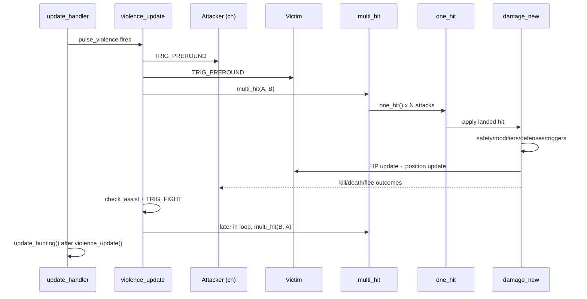
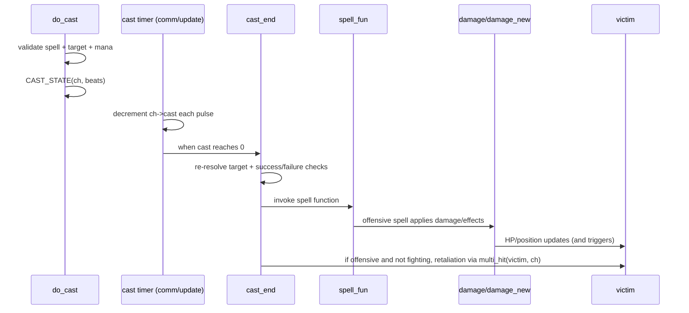
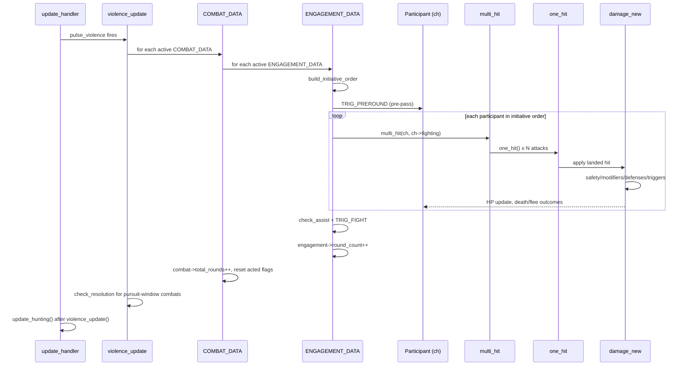

# Combat Round Walkthrough

This guide documents how combat works in the current runtime codepath, from combat start through a full violence pulse, including auto-attacks and active abilities.

Primary files:

- `update.c` (`update_handler`, `aggr_update`, `update_hunting`)
- `fight.c` (`violence_update`, `multi_hit`, `one_hit`, `damage_new`, `set_fighting`)
- `fight2.c` (additional active combat abilities)
- `magic.c` + `comm.c` (casting lifecycle via `do_cast` -> `cast_end`)
- `special.c` + `script_*.c` (AI/script combat initiation)

---

## 1) How combat begins

Combat can start through multiple systems. The runtime eventually converges on either `multi_hit(...)` and/or `set_fighting(...)`.

### A. Direct player combat commands

- `do_kill` starts combat explicitly by calling:
  - `multi_hit(ch, victim, TYPE_UNDEFINED)`
  - `multi_hit(victim, ch, TYPE_UNDEFINED)`
  - `set_fighting(ch, victim)`
- Active skills (examples in `fight.c`/`fight2.c`) such as `do_backstab`, `do_bash`, `do_kick`, `do_trample`, `do_tail_kick`, etc. may:
  - directly call `damage(...)`
  - call `one_hit(...)` / `multi_hit(...)`
  - force counter-engagement by invoking `multi_hit(victim, ch, ...)` on failure or detection.

### B. Offensive spell casting

- `do_cast` configures cast state (`CAST_STATE`) and delays execution.
- Timer updates in `comm.c:update_pc_timers` (players) and `update.c:aggr_update` (NPCs) decrement `ch->cast`.
- When cast completes, `cast_end` executes the spell function.
- For offensive targets, `cast_end` can force retaliation via `multi_hit(victim, ch, TYPE_UNDEFINED)` when target is present and not already fighting.

### C. NPC aggression and hunting

- `update.c:aggr_update` selects valid targets for aggressive NPCs and calls `multi_hit(ch, victim, TYPE_UNDEFINED)`.
- `update.c:update_hunting` moves hunting NPCs and, when they reach target room, initiates with `multi_hit(mob, mob->hunting, TYPE_UNDEFINED)`.

### D. Assist / reaction behavior

- `fight.c:check_assist` is called during `violence_update` and may pull allies into combat via `multi_hit(...)` / `set_fighting(...)`.
- Defensive or detection outcomes inside ability handlers can immediately start retaliation.

### E. Scripted and special-proc initiation

- Mob specials in `special.c` can call `multi_hit(...)` and `do_cast(...)`.
- Script commands (e.g. in `script_mpcmds.c`, `script_commands.c`) can call `multi_hit(...)`, `damage(...)`, or `set_fighting(...)`.

### F. Entering combat from taking damage

- Inside `damage_new`, if attacker and victim are valid and in same room, it ensures combat state by setting `victim->fighting` and `ch->fighting` when needed.

---

## 2) Core pulse that drives combat rounds

### A. Scheduler

- `update_handler` in `update.c` decrements `pulse_violence`.
- On pulse, it calls:
  1. `violence_update()`
  2. `update_hunting()`

### B. `violence_update` high-level order

`violence_update` runs in two major passes over loaded characters:

1. **Pre-round trigger pass**
   - For every valid awake combatant in same room as target, fires `TRIG_PREROUND`.
   - This happens before any attacks are executed for the pulse.

2. **Combat execution pass**
   - Applies round-time regen effects (`healing aura`, `regeneration`, athletics move regen).
   - If `ch->fighting` exists and both are in same room and awake:
     - calls `multi_hit(ch, victim, TYPE_UNDEFINED)`
   - Validates both combatants still exist (`id` checks).
   - Stops combat if separation occurred.
   - Calls `check_assist(ch, victim)`.
   - Fires per-fight triggers (`TRIG_FIGHT`, `TRIG_HPRCT`) on char, carried/worn items, and room.

This means one violence pulse is not "just one swing"; it is a full scripted combat slice including assists and triggers.

---

## 3) Automated attack sequence (`multi_hit` -> `one_hit`)

## A. `multi_hit`

`multi_hit` is the attack-group dispatcher for a combatant in a pulse.

Key behavior:

- Early evasion check (e.g. AFF2 evasion skill proc).
- Reduces wait/daze for NPCs without descriptor.
- Exits if attacker cannot fight (position, exhaustion).
- Ensures combat relationship (`set_fighting`) if needed.
- Branch:
  - NPC attacker -> `mob_hit` (attack count based on mob settings, haste/slow, optional off-flag skills).
  - PC attacker -> baseline `one_hit` plus additional attacks based on haste and skill gates:
    - second / third / fourth / titanic / dual
    - shifted-form extra swings
    - special extra effects like rending.

## B. `one_hit`

`one_hit` resolves one weapon/hand strike attempt.

Main steps:

1. Guard checks (nulls, room mismatch, dead state, conflicting action states like casting/music/etc).
2. Ensure fight state with `set_fighting` if necessary.
3. Determine weapon slot (primary/secondary) and attack type (`dt`, `dam_type`).
4. Compute style/skill context (weapon style, leadership/warcry, mounted style, etc).
5. Roll hit/miss.
   - Miss -> `dam_message(..., -1, ...)`, movement cost, return.
6. On hit, compute base damage from weapon/hand formulas + bonuses.
7. Allow trigger hooks to mutate pending damage (`TRIG_ATTACK`, `TRIG_HIT`).
8. Run layered defenses (acrobatics, catch, spear block, parry, dodge, shield block, speed swerve, script defense).
9. Apply final strike via `damage_new(ch, victim, wield, dam, dt, dam_type, true)`.
10. Resolve post-hit weapon procs (poison/vorpal/vampiric/frost/etc) that may call `damage(...)` again.

---

## 4) Damage resolution pipeline (`damage` / `damage_new`)

In this codebase, `damage(...)` is a macro:

- `#define damage(a,b,c,d,e,f) damage_new((a),(b),NULL,(c),(d),(e),(f))`

So most direct ability damage enters `damage_new`.

## A. `damage_new` sequence

1. **Safety and recursion guards**
   - Rejects invalid/dead/protected states.
   - Uses `victim->in_damage_function` to prevent re-entrant corruption.

2. **Combat/legal checks**
   - Applies safety rules (`is_safe`, safe room, protected flags).
   - Ensures both sides are put into fighting state when appropriate.

3. **Raw damage shaping**
   - PvE/PvP scaling curves.
   - Newbie reductions and area newbie reductions.
   - Sector affinity modifier by damage type.
   - Sanctuary and other effect-based reductions.
   - Immunity/resist/vulnerability application.

4. **Damage trigger hooks**
   - `TRIG_DAMAGE` can reduce/suppress messaging.
   - `TRIG_CHECK_DAMAGE` runs with read-only view.

5. **Messaging + reactive effects**
   - `dam_message(...)` when visible.
   - Barrier effects can reflect partial damage back (`electrical`, `fire`, `frost`) through additional `damage(...)` calls.

6. **Apply HP loss and update position**
   - Subtract `victim->hit`.
   - Run death-protection triggers.
   - `update_pos(victim)` and status messaging.

7. **Death handling (if POS_DEAD)**
   - XP/group gain.
   - kill logs/wiznet.
   - death triggers.
   - corpse creation / raw kill path.
   - autoloot/autogold/autosac processing.

8. **Post-hit flee behavior**
   - NPC wimpy/charm flee logic.
   - Player wimpy flee logic.

---

## 5) Active abilities vs automated combat

### Automated baseline

- Driven by violence pulse -> `multi_hit` -> `one_hit` -> `damage_new`.
- Represents sustained auto-attack throughput.

### Active abilities

- Command handlers (skills/spells) compute their own chance/effects and commonly:
  - call `damage(...)` directly, or
  - call `one_hit` / `multi_hit`, or
  - apply control states (bash/resting/sleep/etc), then optionally trigger follow-up combat.
- Offensive spell path is delayed (`do_cast`) but eventually lands in spell function execution (`cast_end`) and may start/continue combat via retaliation logic.

Net result: active abilities are layered on top of the same core combat/damage state machine, not a separate system.

---

## Pulse sequence diagram



## Active cast sequence diagram



---

## 6) Round mental model (practical)

For a typical pulse where A and B are already fighting in same room:

1. `TRIG_PREROUND` for active combatants.
2. A runs `multi_hit` sequence (possibly multiple `one_hit`s).
3. Each landed hit resolves through `damage_new` (plus procs/reflects).
4. Assistants may join via `check_assist`.
5. `TRIG_FIGHT` hooks fire for actor/items/room.
6. B gets its own turn in iteration and runs same sequence.
7. Separations/flee/death update combat links; next pulse repeats with updated state.

This is the effective "combat round" in the current architecture.

---

## Plan wrap-up

This walkthrough now captures the current combat lifecycle end-to-end (start paths, pulse loop, auto-attacks, active abilities, and final damage resolution), plus two high-level sequence diagrams.

For the core combat rework, this document can serve as:

- the baseline behavior map,
- the regression checklist source when changing combat internals,
- and the reference for deciding where to insert new encounter/event abstractions.

---

## Future State: Combat Under COMBAT_DATA

See `PLAN_COMBAT_ENTITY.md` for the full design. This section summarizes how each part of the current walkthrough changes.

### §1 — How Combat Begins: Same Entry Points, Richer `set_fighting()`

All existing entry paths — `do_kill`, spell retaliation in `cast_end`, `aggr_update`, `check_assist`, scripts — still converge on `multi_hit()` and `set_fighting()`. No entry point changes.

`set_fighting()` becomes the `COMBAT_DATA` lifecycle manager. It runs merge logic (Cases A–D), creates or joins a `COMBAT_DATA`, and opens a new `ENGAGEMENT_DATA` when needed. All callers are transparent to this.

**Compatibility audit required:** `damage_new()` sets `ch->fighting` directly in several places (§1F above). Those sites must route through `set_fighting()` to keep `COMBAT_DATA` consistent with `ch->fighting`.

### §2 — The Violence Pulse: Restructured

Current inner loop iterates all loaded characters checking `ch->fighting`. Future loop:

```
for each COMBAT_DATA in active_combats:

    if active_engagements is empty:
        decrement pursuit_timer → check_resolution if expired
        continue

    for each ENGAGEMENT_DATA in active_engagements:
        build_initiative_order(engagement)
        for each PARTICIPANT_DATA in initiative_order (sorted, active, alive):
            multi_hit(ch, ch->fighting, TYPE_UNDEFINED)
            check_assist(ch, ch->fighting)
            fire_combat_triggers(ch)
        engagement->round_count++

    combat->total_rounds++
    reset acted_this_round across all active participants
```

`TRIG_PREROUND` narrows from a scan of all loaded chars to active combat participants only, still firing before any attacks in the pulse.

`check_assist()` still exists in approximately the same position but inserts helpers into the correct `COMBAT_DATA` and `ENGAGEMENT_DATA` rather than only setting `ch->fighting`.

**Net effect:** Only actual combatants are processed each pulse. Processing order is deterministic (initiative roll) rather than arbitrary list traversal.

### §3 — `multi_hit` / `one_hit`: Unchanged

The attack dispatcher and single-strike resolver do not change. Initiative determines *when* `multi_hit` is called within the pulse, but what it does — evasion, attack count, weapon selection, `one_hit` loop — is identical.

One addition: between `one_hit` iterations, the existing `is_combatant_valid()` id-check may also verify the engagement is still active, since a participant could die or flee earlier in the same round's initiative order.

### §4 — `damage_new`: Two Integration Points

The damage pipeline is unchanged. Two sites interact with the new model:

- **Step 2 (combat state enforcement):** Direct assignments to `ch->fighting` and `victim->fighting` inside `damage_new` must route through `set_fighting()` to keep `COMBAT_DATA` consistent.
- **Step 7 (death handling):** NPCs currently hit `extract_char()` immediately. Participants tracked in a `COMBAT_DATA` instead enter `dead = true` state and remain until they release or the combat resolves. Standard non-companion NPCs continue to extract immediately.

### §5 — Active Abilities: Unchanged

Spell and skill handlers call `damage()`, `one_hit()`, or `multi_hit()` directly — no change. The only downstream effect is that these calls may invoke `set_fighting()` which now manages `COMBAT_DATA`, transparent to the ability code.

### §6 — Round Mental Model: Updated

**Current model** (A and B fighting):
```
1. TRIG_PREROUND for active combatants
2. A runs multi_hit sequence
3. check_assist + TRIG_FIGHT hooks
4. B gets its own turn in iteration
```

**Future model** (same combat, two simultaneous engagements):
```
1. TRIG_PREROUND for all participants across all active engagements

2. Engagement 1 (Room A — main fight):
     roll initiative: A=14, B=9, C=17 → order: C, A, B
     C acts: multi_hit → one_hit loop
     A acts: multi_hit → one_hit loop
     B acts: multi_hit → one_hit loop
     check_assist, TRIG_FIGHT for this engagement

3. Engagement 2 (Room B — add pursuing ranged caster):
     roll initiative: D=11, E=6 → order: D, E
     D acts: multi_hit → one_hit loop
     E acts: multi_hit → one_hit loop
     check_assist, TRIG_FIGHT for this engagement

4. combat->total_rounds++
5. Reset acted_this_round across all participants
```

The mental model shifts from "one loop over everyone" to "one loop over engagements, each with its own initiative-ordered participant loop."

### Sequence Diagram: Future State Pulse



---

## Combat Recording

The `COMBAT_DATA` and `ENGAGEMENT_DATA` structures naturally accumulate a structured history of a fight. Combined with the unified combat event pipeline planned in `PLAN_COMBAT_LOOP_AND_DAMAGE_REWORK.md` (Section E), this creates the foundation for **combat recording and replay**.

### What the current design already captures

- Full participant list with per-participant damage dealt/taken, flee count, rounds active, threat generated
- Engagement history: room(s), round count, how it ended, when it started and closed
- Combat-wide telemetry: total damage, total flees, total rounds, PvP flag, start time

### What a structured event log would add

If each engagement maintains an ordered event log alongside the summary fields, a full round-by-round replay becomes possible:

```c
struct combat_event {
    int                  round;
    long                 timestamp;
    combat_event_type_t  type;          /* ATTACK, DAMAGE, MISS, FLEE, SPELL, DEATH, etc. */
    unsigned long        actor_id[2];
    unsigned long        target_id[2];
    int                  value;         /* damage amount, healing amount, etc. */
    int                  dam_type;
    char                *detail;        /* optional: spell name, weapon name, ability */
};
```

This event log is the structured form of the combat messages that currently go to `dam_message()` and the various act() calls. The unified combat messaging pipeline (Section E of the combat rework plan) would route all of those through this structure.

### Use cases

- **Player post-mortem:** "What killed me?" — review the event log for the engagement where you died.
- **Balance telemetry:** Aggregate event logs to build damage distribution histograms without live observers.
- **Admin review:** GMs can inspect recorded combats for exploit investigation.
- **Scripted encounters:** Boss scripts can query the current combat's event log to make phase-transition decisions ("if more than 30% of damage came from fire spells, trigger immunity phase").
- **Tutorial replay:** Record a demonstration combat and play it back for new players.

### Storage considerations

Full event logs are only needed for diagnostics — not every combat needs a permanent record. A ring buffer of the last N combats (configurable) covers most operational needs. Boss/PvP combats could be flagged to retain logs longer. Raw event logs can be serialized to JSON and stored in `data/stats/` using existing infrastructure.